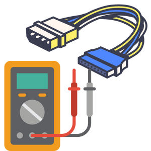

<p align="center">
  <a href="" rel="noopener">
 </a>
</p>

<h3 align="center">RPi Cable Tester</h3>

<div align="center">

[]()


</div>

---


<p align="center"> RPi Cable Tester
    <br> 
</p>

## 📝 Table of Contents

- [📝 Table of Contents](#-table-of-contents)
- [🧐 About <a name = "about"></a>](#-about-)
- [Getting Started <a name = "getting_started"></a>](#getting-started-)
  - [AutoStart on Boot<a name = "Installation"></a>](#autostart-on-boot)
- [Usage <a name = "usage"></a>](#usage-)
- [⛏️ Built Using <a name = "built_using"></a>](#️-built-using-)
- [✍️ Authors <a name = "authors"></a>](#️-authors-)


## 🧐 About <a name = "about"></a>

This repo contain files and detailed instructions on running the RPi Cable Tester Program.


## Getting Started <a name = "getting_started"></a>

- Copy Firmware folder to the Destkop of your Raspberry Pi.

### AutoStart on Boot<a name = "Installation"></a>

Open the terminal on your Raspberry Pi and execute the following command

- ```sudo nano /etc/rc.local```

Then put the following line before `exit 0` 
-   ```(sleep 5; sh /home/pi/Desktop/Firmware/starter.sh)&```
-   Press CTRL+O and CTRL+X to save and exit.

## Usage <a name = "usage"></a>


## ⛏️ Built Using <a name = "built_using"></a>

- [Python](https://www.python.org/) - For programming the Watchman Service
  

## ✍️ Authors <a name = "authors"></a>

- [@Nauman3S](https://github.com/Nauman3S) - Development
